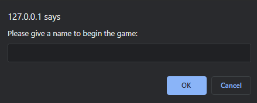
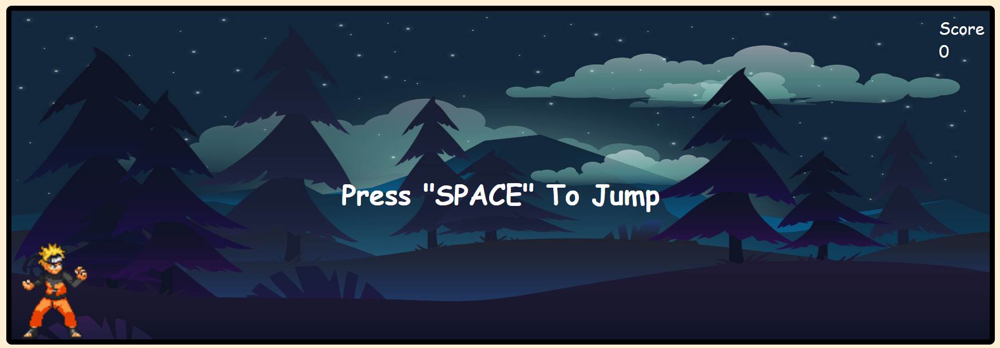
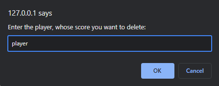
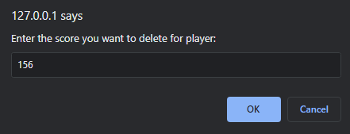
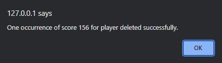
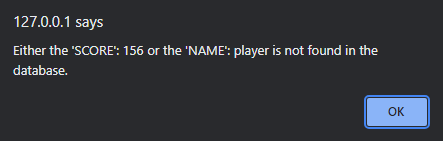
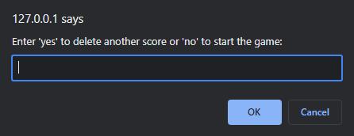
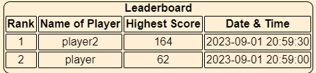

# Run Naruto Run

Das Spiel "Run Naruto Run" ist ähnlich wie das klassische Spiel "Dino Runner", das auf der Offline-Fehlerseite von
Google
Chrome zu finden ist. In diesem Spiel läuft und springt statt des "Dinosauriers" eine Figur aus dem berühmten Anime "
Naruto"
springt über den Feuerball. Das Spiel ist ein Endlosspiel, und der Charakter könnte ewig laufen, aber je weiter er geht,
aber je weiter er geht, desto schneller wird das Spiel. Der Punktestanddes Spiels wird nach der Zeit berechnet, also
danach,
wie lange der Spieler das Spiel spielen kann.

## Welche TechStacks werden für die Entwicklung dieses Spiels verwendet?

Im Spiel werden HTML, CSS und JavaScript verwendet, um das Frontend des Spiels zu erstellen, während das Backend mit
Hilfe
von Python (Flask) bearbeitet und für die Datenbank wurde SQLite verwendet. Das Spiel folgt das Prinzip von MVC (Model,
View, Controller) und nutzt auch DOM(Document Object Model)-Tree.

## Wie spielt man also das Spiel?

Wenn eine Person auf ihrem lokalen Gerät spielen möchte, muss sie die app.py ausführen. Danach wird der Link in der
Konsole angezeigt, wenn er angeklickt wird, wird das Spiel geöffnet.

Nach dem Öffnen des Spiels wird die Person aufgefordert, ihren Namen in einer Eingabeaufforderung anzugeben.

- Wenn die Person einen leeren String oder ein Leerzeichen als Namen eingibt, wird sie aufgefordert, ihren Namen erneut
  einzugeben.

- Wenn die Person einen Namen eingibt, dann darf sie das Spiel spielen.
    - Wenn die Person nach dem Spiel den Namen ändern möchte, muss sie die Seite neu laden.
      

- Wenn die Person ihren Namen als "admin" eingibt, wird sie von der Konsole als "Administrator" eingeloggt.
    - Dann wird er aufgefordert, den Namen des Spielers zu löschen.

  
    - Und dann will er, dass die Punkte gelöscht wird.

  

    - Wenn der Spieler mit dem Spielstand in der Datenbank zu finden ist, wird er gelöscht.

  

    - Wenn der Spieler mit der Punktzahl oder die Punktzahl des Spielers nicht in der Datenbank gefunden wird, wird eine
      Fehlermeldung ausgegeben.

  

- Nach der erfolgreichen oder fehlgeschlagenen Löschung des Spielstands wird der ADMIN aufgefordert, einen weiteren
  Spielstand zu löschen. Wenn er einen weiteren Spielstand löschen möchte, muss er dies bejahen, was dazu führt, dass er
  den Namen eines anderen Spielers eingeben muss. Wenn der ADMIN verneint, kehrt er zur ersten Aufforderung zurück.

  

#### Es ist notwendig, die Seite zu aktualisieren, um die Änderung zu sehen, andernfalls kann der ADMIN weitermachen und die zweite Punkte löschen und die Änderung vom der ersten Punkte sehen, die gelöscht wurde.

## Wo kann man der Leaderboard sehen?

- Die Leaderboard finden Sie unten auf der Seite.

